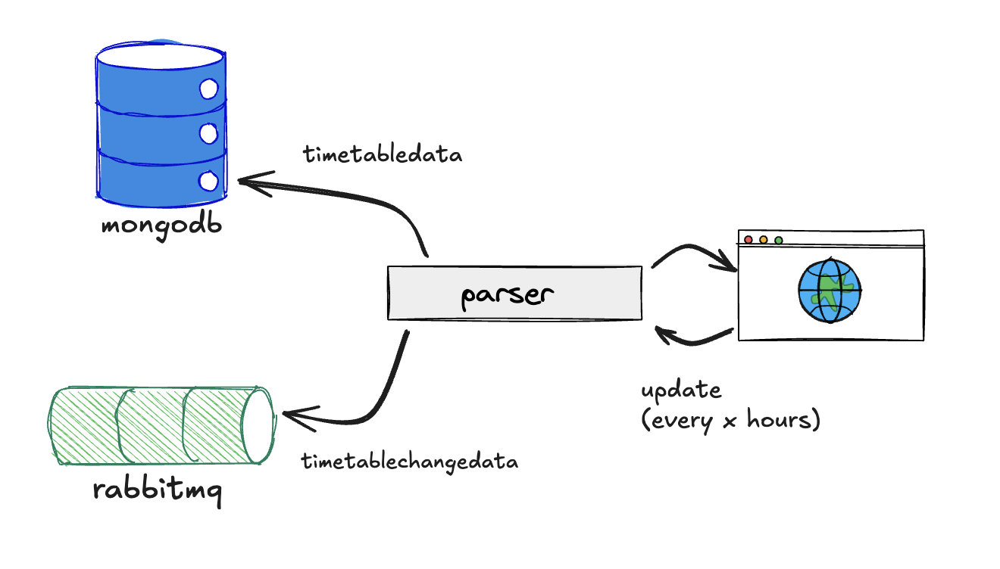
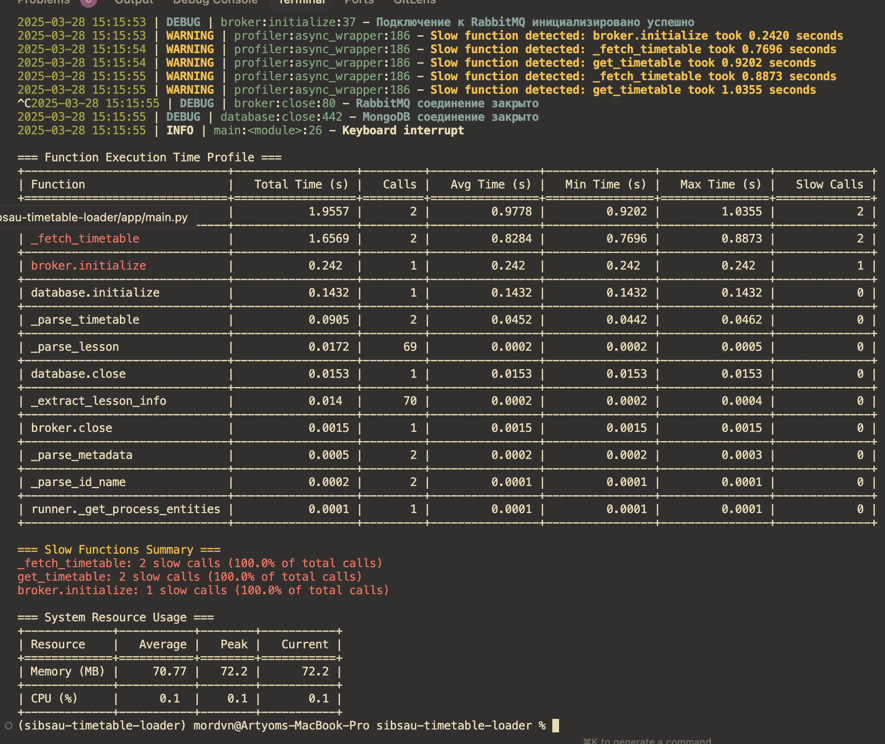
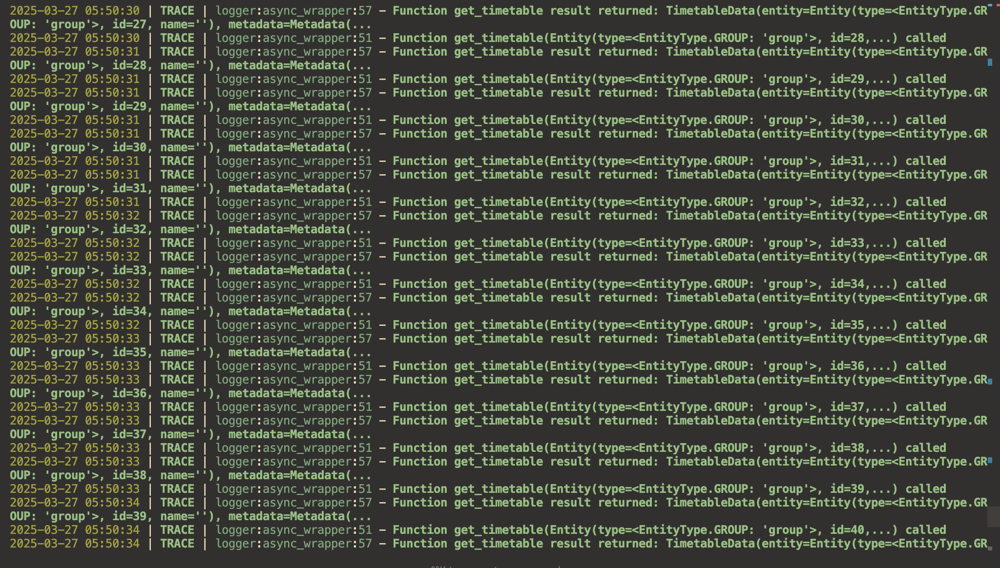

# SibSAU Timetable Loader

Парсер и загрузчик расписания Сибирского государственного университета (СибГУ). Инструмент автоматически собирает данные о расписании в базу данных, отслеживает изменения и отправляет обновления через брокер сообщений.

## Архитектура проекта



## Примеры работы





## 🚀 Установка и запуск

### Ручная установка

```bash
# Клонирование репозитория
git clone https://github.com/yourusername/sibsau-timetable-loader.git
cd sibsau-timetable-loader

# Установка зависимостей (с использованием uv)
uv sync --frozen

# Запуск приложения
uv run python3 app/main.py
```

### Использование Docker (Dockploy, ...)

```bash
# Сборка образа
docker build -t sibsau-timetable-loader .

# Запуск контейнера
docker run -d --name timetable-loader \
  --env-file .env \
  sibsau-timetable-loader
```

## Переменные окружения

Необходимо создать файл `.env` в корне проекта. Пример переменных окружения можно найти в `app/config.py`.

## 🌐 Развертывание на dokploy

1. Выберите Git-репозиторий для развертывания
2. Укажите переменные окружения (смотрите app/config.py)
3. Запустите сборку и развертывание

## 💻 Разработка

### Форматирование кода

```bash
# Форматирование кода с использованием ruff
uv run ruff format .
```

### Как внести свой вклад

1. Форкните репозиторий
2. Создайте ветку для новой функциональности (`git checkout -b feature/amazing-feature`)
3. Внесите свои изменения
4. Закоммитьте изменения (`git commit -m 'add some amazing feature'`)
5. Отправьте изменения в свой форк (`git push origin feature/amazing-feature`)
6. Откройте Pull Request в основной репозиторий

## О проекте

Проект разработан с любовью к Сибирскому государственному университету науки и технологий имени М.Ф. Решетнёва (СибГУ). ❤️
